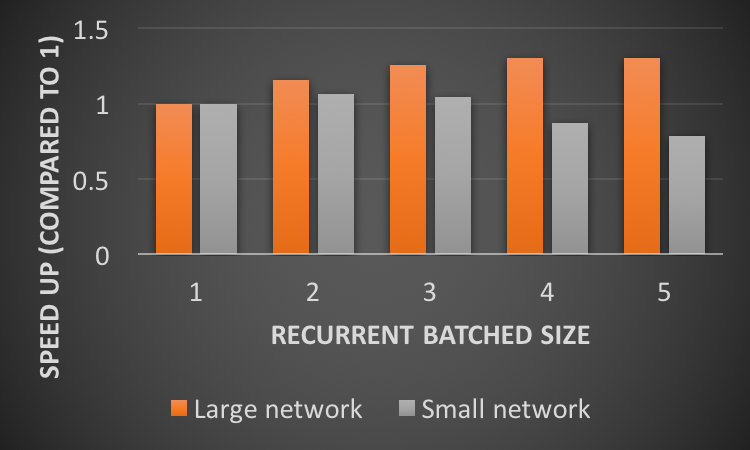
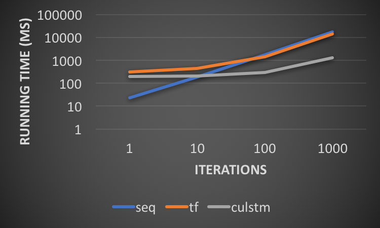
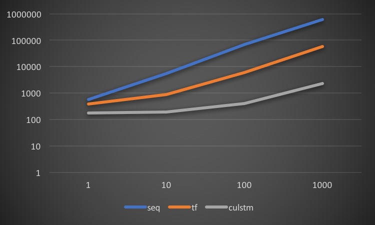
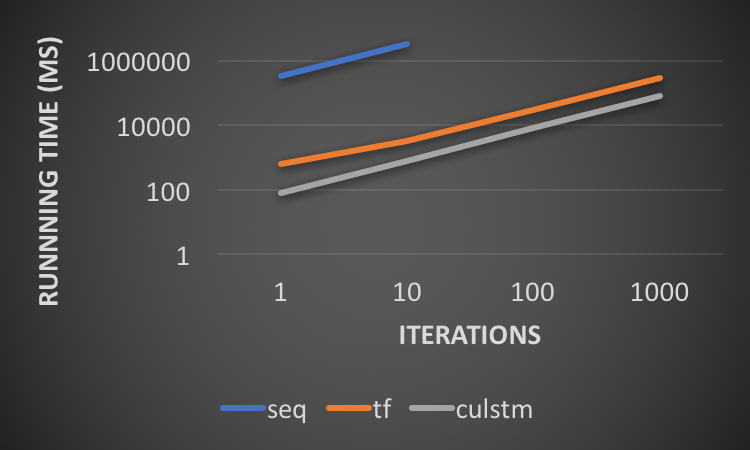
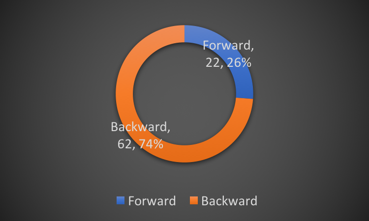
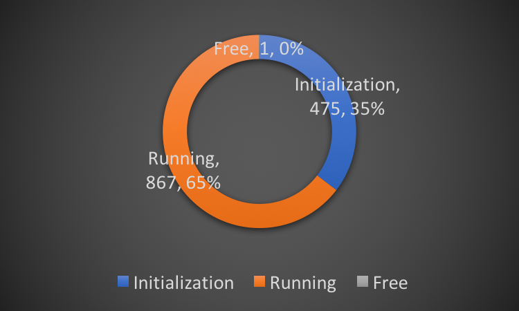
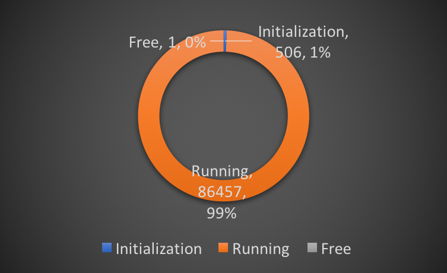
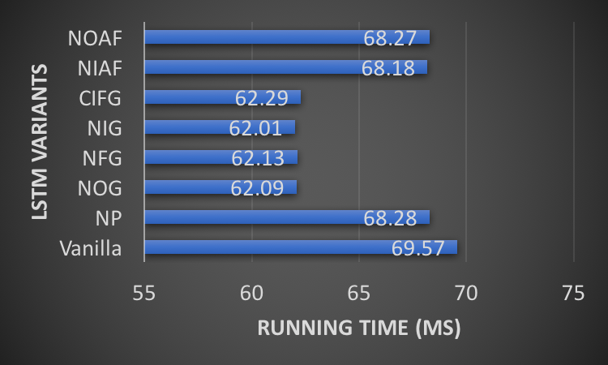

<script type="text/javascript" src="https://cdn.mathjax.org/mathjax/latest/MathJax.js?config=TeX-MML-AM_CHTML"> </script>
# Final Writeup

## Summary
<!--A short (no more than a paragraph) project summary. If applicable, the summary should list your project deliverables (including what you plan to show at the parallelism competition) and what machines they ran on.-->

In this project, we implemented **CuLSTM**, a _Domain-Specific Language_ (DSL) for _Long Short-Term Memory_ (LSTM). The DSL is able to generate CUDA code based on LSTM network definition and specification in Python. CuLSTM supports multiple LSTM variants, and allows great flexibility, such as user-defined loss function and parameters. The outcome is a **productive** Python interface, as well as a **performant** program running on GPU. The evaluations on GHC machines (with NVIDIA GeForce GTX 1080) showed that our implementation achieved a **>1000x** speedup compared to the sequential version, and a **3x** speedup compared to TensorFlow running on GPU.

## Background
<!--Describe the algorithm, application, or system you parallelized in computer science terms. (Recall our discussion from the last day of class.) Figure(s) would be really useful here.-->
As a _recurrent neural network_ (RNN) architecture, _long short-term memory_ (LSTM) excels at learning from past experience to classify, process, and predict time series. The LSTM units are able to remember values for either long or short durations of time, due to no activation function within the recurrent components. Containing several LSTM units, a LSTM block contains three or four "gates" controlling the flow of information. Figure 1 shows the chain of repeating LSTM blocks with four LSTM units.

  
**Figure 1:** *The chain of LSTM blocks consisting of four LSTM units.*

Despite similar ideas, different LSTM variants have individual network structures and formulas. Common variants include vanilla LSTM [[Graves 2005](http://www.sciencedirect.com/science/article/pii/S0893608005001206)], traditional LSTM [[Hochreiter 1997](http://www.mitpressjournals.org/doi/abs/10.1162/neco.1997.9.8.1735)], Peephole LSTM [[Gers 2000](http://ieeexplore.ieee.org/abstract/document/861302/)], etc. The following formulas show the operations for traditional LSTM in each iteration.

$$\begin{aligned}
z_t&=g(\mathbf{W}_{c}x_{t}+\mathbf{R}_{c}h_{t-1}+b_{c})\\
f_{t}&=\sigma (\mathbf{W}_{f}x_{t}+\mathbf{R}_{f}h_{t-1}+p_f\circ c_{t-1}+b_{f})\\
i_{t}&=\sigma (\mathbf{W}_{i}x_{t}+\mathbf{R}_{i}h_{t-1}+p_i\circ c_{t-1}+b_{i})\\
o_{t}&=\sigma (\mathbf{W}_{o}x_{t}+\mathbf{R}_{o}h_{t-1}+p_o\circ c_{t}+b_{o})\\
c_{t}&=f_{t}\circ c_{t-1}+i_{t}\circ z_t\\
h_{t}&=o_{t}\circ h(c_{t})\end{aligned}$$

The training for LSTM involves a series of _matrix-matrix multiplications_ (GEMMs) and lots of point-wise operations on vectors.  Therefore, it is both necessary and natural to execute it in parallel. However, writing efficient CUDA code is extremely troublesome for users and machine learning researchers. Our goal is develop a Python library that generates CUDA code automatically. By identifying the pattern of LSTM variants, our library could schedule them with different schemes, and achieve a good performance in most cases.

## Approaches
<!--Tell us how your implementation works. Your description should be sufficiently detailed to provide the course staff a basic understanding of your approach. Again, it might be very useful to include a figure here illustrating components of the system and/or their mapping to parallel hardware.-->
### Code Auto-generation
The following code shows an example of our CuLSTM interface. It defines a LSTM network in just a few lines of code. This code will call CuLSTM library, which will assemble CUDA code blocks as well as parameters. Finally, a CUDA file will be generated and is ready be ran on GPU.
```scala
lstm_input = LstmInput(inputSize, seqLength)
lstm_output = LstmOutput(hiddenSize, seqLength)
lstm_config = LstmConfig(inputSize, hiddenSize, numLayers, seqLength, miniBatch, Peepholes=False)
lstm_net = LstmNetwork(lstm_config)
lstm_net.run(lstm_input, lstm_output)
lstm_net.clean()
```

Our interfaces support a wide area of specification. Here is a list of customized functions:

| Category | Functions |
| :--- | :--- |
|Input/Label data|Padding, mask on label|
|Configuration|Input size, hidden size, sequence length, mini-batch size, number of layers|
|Node definition|8+ LSTM variants, user-defined activation function|
|Network specification|Loss function|

### Optimizations for Back-propagation
Our optimization approaches are mainly inspired by the forward propagation  implementation of [Jeremy Appleyard](https://devblogs.nvidia.com/parallelforall/optimizing-recurrent-neural-networks-cudnn-5/). We will illustrate how these optimization ideas are applied in our back-propagation implementation.

Before we start, here are some parameters used in our program:
- **Sequence length**: The length of time sequences
- **Network layer**: The number of LSTM network layers
- **Hidden size**: The dimension of hidden layers and output data
- **Mini-batch size**: The number of training examples processed in a mini-batch
- **Input size**: The dimension of input data
- **Peephole**: Use Peephole LSTM or not

#### Step 1: Optimizing a Single Iteration
The back-propagation process of each iteration includes a series of point-wise operations:

$$\begin{aligned}
\delta y_t &= \Delta_t + \mathbf{R}_z^T\delta z_{t+1} + \mathbf{R}_i^T\delta i_{t+1} + \mathbf{R}_f^T\delta f_{t+1} + \mathbf{R}_o^T\delta o_{t+1}\\  \mid &\delta i_{t}, \delta f_{t}, \delta z_{t},\delta o_{t}\big] \propto \delta y_{t}
\end{aligned}$$
<!-- \quad
\delta f_{t} \propto \delta y_{t}\quad
\delta i_{t} \propto \delta y_{t}\quad
\delta z_{t} \propto \delta y_{t}\\ -->

If the cell is not belonged to a base layer, it needs to calculate the delta of the next layer as

$$\delta x_t = \mathbf{W}_z^T\delta z_{t} + \mathbf{W}_i^T\delta z_{t} + \mathbf{W}_f^T\delta f_{t} + \mathbf{W}_o^T\delta o_{t}$$

Finally, the gradients for weights are calculated as

$$\begin{aligned}
\delta \mathbf{W}_{\star} &= \sum\nolimits^T_{t=0} \langle \delta\star_t,x_t\rangle&
\delta p_{f} &= \sum\nolimits^{T-1}_{t=0} c_t \circ \delta f_{t+1}\\
\delta \mathbf{R}_{\star} &= \sum\nolimits^{T-1}_{t=0} \langle \delta\star_{t+1},y_t\rangle&
\delta p_{i} &= \sum\nolimits^{T-1}_{t=0} c_t \circ \delta i_{t+1}\\
\delta b_{\star} &= \sum\nolimits^{T}_{t=0} \delta\star_{t}&
\delta p_{o} &= \sum\nolimits^{T}_{t=0} c_t \circ \delta o_{t}\\
\end{aligned}$$

As illustrated in the above equations, the back-propagation process has stronger recurrent dependencies since $$\delta y_t$$ is relied on the $$\big[\delta i_{t+1},\delta f_{t+1}, \delta o_{t+1}, \delta z_{t+1}\big]$$ from the previous iteration as well as $$\Delta_t = \delta x_t$$ from the upper layer. Therefore, the propagation of deltas needs to be performed iteration by iteration.


##### Optimization 1: Fusing Point-wise Operations
To improve arithmetic density, we fused all point-wise operations together into one kernel with **hiddenSize x miniBatch** threads. The calculation of peephole gradients are also performed inside.

We also perform peephole gradients calculation here. To avoid false sharing, we tradeoff memory for efficiency by allocating totally **3 x hiddenSize x miniBatch** space for $$\delta p_\star$$. After the point-wise operations, **cublasSgemv** is used to aggregate all the gradients together.


##### Optimization 2: Combining GEMM Operations
Originally, $$\mathbf{W}_\star$$ and $$\mathbf{R}_\star$$ together require eight GEMMs to be calculated. By aggregating $$\delta_\star$$ into one matrix $$\mathbf{S}$$ with size of **4 x hiddenSize x miniBatch**, only two GEMMs (i.e. $$\mathbf{W}_{*}^T\mathbf{S}$$ and $$\mathbf{R}_{*}^T\mathbf{S}$$) are needed.


By using the above two optimizations, the gradient propagation part for each iteration contains only one point-wise operation kernel and two GEMMs. Pseudo-code for the method follows.
```c++
for layer in layers:
  for iteration in iterations:
    perform point-wise operations in one kernel
    calculate dx for next layer
    calculate dy for next iteration
    accumulate the weights different
perform the weights updates
```

#### Step 2: Optimizing with Each Layer

##### Optimization 3: Grouping Weight Updates
The weight updates are heavy if performed in a accumulated way. Also, it requires extra memory allocation to store the temporary gradient. By grouping the weight updates process, a larger matrix can be used in each iteration and no extra memory is needed. The optimized pseudo-code follows.
```c++
for layer in layers:
  for iteration in iterations:
    perform point-wise operations
    calculate dx for next layer
    calculate dy for next iteration
  if end of layer:
    perform the weights updates
```

##### Optimization 4: Combining GEMMs
The revised pseudo-code follows.
```c++
for layer in layers:
  for iteration in iterations:
    for sub-iteration in combined size:
      wait for upper deltas
      perform point-wise operations
      calculate dy for next iteration
    calculate dx for next layer
  if end of layer:
    perform the weights updates
```
#### Step 3: Optimizing with Many Layers

##### Optimization 5: Streaming
The back-propagation dependencies can be seen from Fig. 2, where the red cells are independent with each other. Ideally, **numLayer** iterations can run concurrently, meaning that the LSTM networks with more layers have more parallelism to exploit.

  
**Figure 2:** *Back-propagation dependencies*

We have created  **numlayer** asynchronous cuda streams and set the GEMMS and element-wise operations from different layers into asynchronous streams  corresponds to their layer index. Therefore,  horizontal dependencies can be ensured because kernels run sequentially within the same stream. The vertical dependencies are protected by  **cudaStreamWaitEvent** commands.  


## Experiment Results

### Settings
We did experiments on GHC machines with NVIDIA GeForce GTX 1080 GPU. We used three sizes of LSTM networks, which are shown below:

| Parameters | Small | Medium | Large |
| :--- | :---: | :---: | :---: |
| Sequence length | 10 | 20 | 100 |
| Network layer | 2 | 4 | 4 |
| Hidden size | 10 | 32 | 512 |
| Mini-batch size | 10 | 64 | 64 |
| Input size | 10 | 32 | 512 |
| Peephole | Y | Y | Y |
### Optimization breakdown
| Optimization | Runtime(ms) | Speedup |
| :--- | :---: | :---: |
|Baseline |159.0|1.0x|
|Combined GEMMs |108.4|1.46x|
|Streaming|76.7 |2.07x|
|Batched Gradient|107.8|1.47x|
|Altogether|47.7|3.96x|
**Table 1:** *Optimization speedup against the baseline code*

Table 1. shows the speedup of optimizations by comparing the average back-propagation runtime with the baseline implementation experimenting on a large LSTM network containing 4 layers, 100 sequences and 512 hidden dimensions. Notice that The baseline code is the implementation without these three optimizations with many optimizations already applied.

The streaming method alone can generate approximately 2x speedup and can provide a total speedup of 3.96x when three of optimizations all applied.
### Parameter Tuning
In our batched gradient propagation, the larger batch size can form a larger matrix as the input in GEMM and therefore can have a  better utilization of the GPU computability and have a lower amortized kernel launch cost.

However, larger batch size will also cause greater interference on the propagation to the next level. So, there exists a tradeoff regarding the choice of batch size.


  
**Figure 3:** *Speedup trend with increasing batch size*

As shown in the Figure 3, we experiment increasing batch size with two LSTM networks with different scale and find out that 2 works best for small network (sequence length = 20, hidden size = 64) and the increasing batch size will always perform better for the large network setting (sequence length = 100, hidden size = 512).  
<!-- With our experiment, 2 works best for small network and 7 works the best for large network.  -->


<!--How successful were you at achieving your goals? We expect results sections to differ from project to project, but we expect your evaluation to be very thorough (your project evaluation is a great way to demonstrate you understood topics from this course).-->


### Comparison with Sequential Version and TensorFlow

We compared the performance of CuLSTM with a sequential implementation in Python and TensorFlow using CuDNN library. Figure 3 shows the experiment result, which means the cumulative training time for 1 - 1,000 iterations. We can see that our implementation outperforms the sequential one for more than 1,000x, and also has a 3x speed up compared to TensorFlow for large network. Another observation is that sequential code is the best in the first iteration for smaller network. It is due to the initialization and memory copy overhead of GPU, which will be amortized among iterations.

  
**(a)** *Small network. (log-log)*  
  
**(b)** *Medium network. (log-log)*  
  
**(c)** *Large network. (log-log)*  
**Figure 3:** *Comparison with sequential code and TensorFlow. (ms)*

### Training Time
Figure 4 shows the forward and backward cost of trainings in each iteration on a large network. Back-propagation used a relatively more time, which is because the dependency is more complex than forward propagation.

  
**Figure 4:** *Forward and backward cost. (ms)*

### Data Movement Cost
Data movement is a main source of time and energy cost for GPU applications. We recorded the time of data initialization and memory free on default setting, and showed the result in Fig. 5. The absolute time (in ms) and percentage of each part are shown in the figure. We can see from Fig. 5(a) that, when we train the network for 10 iterations, the cost of initialization is relatively high. However, in Fig. 5(b), as we train for more iterations, it remains constant, and becomes trivial relative to running time.

  
**(a)** *10 iterations.*  
  
**(b)** *1,000 iterations.*  
**Figure 5:** *Cost of data movement. (ms)*


### LSTM Variants
Figure 5 shows the performance of different LSTM variants. We supported 8 variants in total. Vanilla LSTM contains all components in the nodes, and other variants are a subset of it. From the figure, we can see that their running time is less than vanilla LSTM, since we optimized memory and computation cost of each variant.

  
**Figure 5:** *Running time of LSTM variants. (ms)*


## References
<!--Please provide a list of references used in the project.-->
- Christopher Olah. "Understanding LSTM Networks." [Link](http://colah.github.io/posts/2015-08-Understanding-LSTMs/)
- Klaus Greff, Rupesh K. Srivastava, Jan Koutník, Bas R. Steunebrink, and Jürgen Schmidhuber. "LSTM: A Search Space Odyssey." IEEE transactions on neural networks and learning systems (2016). [PDF](https://arxiv.org/pdf/1503.04069.pdf)
- Jeremy Appleyard. "Optimizing Recurrent Neural Networks in cuDNN 5." [Link](https://devblogs.nvidia.com/parallelforall/optimizing-recurrent-neural-networks-cudnn-5/)
- Jeremy Appleyard, Tomáš Kociský, and Phil Blunsom. "Optimizing Performance of Recurrent Neural Networks on GPUs." arXiv preprint arXiv:1604.01946 (2016). [PDF](https://arxiv.org/pdf/1604.01946.pdf)
- Szymon Sidor, "Simple Implementation of LSTM in Tensorflow." [Link](https://gist.github.com/nivwusquorum/b18ce332bde37e156034e5d3f60f8a23)

## Work by Each Student
<!--If your project is a team project, please list the work performed by each partner. If you do not feel comfortable placing this information on a public web page, you may email the course staff this information directly. Alternatively, you can simply state: "equal work was performed by both project members."-->
Equal work was performed by both project members.
