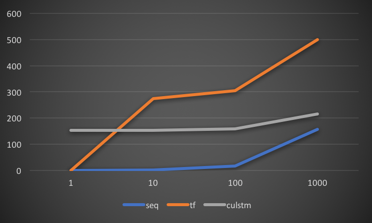

<script type="text/javascript" src="https://cdn.mathjax.org/mathjax/latest/MathJax.js?config=TeX-MML-AM_CHTML"> </script>
# Final Writeup

## Summary
<!--A short (no more than a paragraph) project summary. If applicable, the summary should list your project deliverables (including what you plan to show at the parallelism competition) and what machines they ran on.-->

In this project, we implemented **CuLSTM**, a _Domain-Specific Language_ (DSL) for _Long Short-Term Memory_ (LSTM). The DSL is able to generate CUDA code based on LSTM network definition and specification in Python. CuLSTM supports multiple LSTM variants, and allows great flexibility, such as user-defined loss function and parameters. The outcome is a productive Python interface, as well as a performant program running on GPU. The evaluations on GHC machines (with NVIDIA GeForce GTX 1080) showed that our implementation achieved a 268x speedup compared to the sequential version, and a 25x speedup compared to TensorFlow running on GPU.

## Background
<!--Describe the algorithm, application, or system you parallelized in computer science terms. (Recall our discussion from the last day of class.) Figure(s) would be really useful here.-->
As a _recurrent neural network_ (RNN) architecture, _long short-term memory_ (LSTM) is excel at learning from past experience to classify, process, and predict time series. The LSTM units are able to remember values for either long or short durations of time, due to no activation function within the recurrent components. Containing several LSTM units, a LSTM block contains three or four "gates" controlling the flow of information. Figure 1 shows the chain of repeating LSTM blocks with four LSTM units.

  
**Figure 1:** *The chain of LSTM blocks consisting of four LSTM units.*

Despite similar ideas, different LSTM variants have individual network structures and formulas. Common variants include vanilla LSTM [[Graves 2005](http://www.sciencedirect.com/science/article/pii/S0893608005001206)], traditional LSTM [[Hochreiter 1997](http://www.mitpressjournals.org/doi/abs/10.1162/neco.1997.9.8.1735)], Peephole LSTM [[Gers 2000](http://ieeexplore.ieee.org/abstract/document/861302/)], etc. The following formulas show the operations for traditional LSTM in each iteration.

$$\begin{aligned}
z_t&=g(W_{c}x_{t}+R_{c}h_{t-1}+b_{c})\\
f_{t}&=\sigma (W_{f}x_{t}+R_{f}h_{t-1}+p_f\circ c_{t-1}+b_{f})\\
i_{t}&=\sigma (W_{i}x_{t}+R_{i}h_{t-1}+p_i\circ c_{t-1}+b_{i})\\
o_{t}&=\sigma (W_{o}x_{t}+R_{o}h_{t-1}+p_o\circ c_{t}+b_{o})\\
c_{t}&=f_{t}\circ c_{t-1}+i_{t}\circ z_t\\
h_{t}&=o_{t}\circ h(c_{t})\end{aligned}$$

The training for LSTM involves a series of _matrix-matrix multiplications_ (GEMMs) and lots of point-wise operations on vectors.  Therefore, it is both necessary and natural to execute it in parallel. However, writing efficient CUDA code is troublesome for some users and machine learning researchers. Our goal is develop a Python library that generates CUDA code automatically. By identifying the pattern of LSTM variants, our library could schedule them with different schemes, and achieve a good performance in most cases.
## Approach
<!--Tell us how your implementation works. Your description should be sufficiently detailed to provide the course staff a basic understanding of your approach. Again, it might be very useful to include a figure here illustrating components of the system and/or their mapping to parallel hardware.-->
Our optimization approach are mainly inspired by the forward propagation  implementation of [Jeremy Appleyard](https://devblogs.nvidia.com/parallelforall/optimizing-recurrent-neural-networks-cudnn-5/). We will illustrate how these optimization ideas are applied in our back propagation implementation.  
### Step 1: Optimizing a Single iteration
The back propagation process of each iteration includes a series of point-wise operations:

$$\begin{aligned}
\delta y_t &= \Delta_t + R_z\delta z_{t+1} + R_i\delta i_{t+1} + R_f\delta f_{t+1} + R_o\delta o_{t+1}\\ \delta o_{t}& \propto \delta y_{t}\quad
\delta f_{t} \propto \delta y_{t}\quad
\delta i_{t} \propto \delta y_{t}\quad
\delta z_{t} \propto \delta y_{t}\\
\end{aligned}$$

If the cell is not belonged to a base layer, it needs to calculate the delta of the next layer as

$$\delta x_t = W_z\delta z_{t} + W_i\delta z_{t} + W_f\delta f_{t} + W_o\delta o_{t}$$

After all, the gradients for weights are calculated as

$$\begin{aligned}
\delta W_{\star} &= \sum\nolimits^T_{t=0} \langle \delta\star_t,x_t\rangle&
\delta R_{\star} &= \sum\nolimits^{T-1}_{t=0} \langle \delta\star_{t+1},y_t\rangle\\
\delta b_{\star} &= \sum\nolimits^{T}_{t=0} \delta\star_{t}&
\delta p_{i} &= \sum\nolimits^{T-1}_{t=0} c_t \circ \delta i_{t+1}\\
\delta p_{f} &= \sum\nolimits^{T-1}_{t=0} c_t \circ \delta f_{t+1}&
\delta p_{o} &= \sum\nolimits^{T}_{t=0} c_t \circ \delta o_{t}\\
\end{aligned}$$

As illustrated in the above equations, the back propagation process has stronger recurrent dependencies since $$\delta y_t$$ is relied on the $$\delta i_{t+1},\delta f_{t+1}, \delta o_{t+1},  \delta z_{t+1}$$ from the previous iteration as well as $$\Delta_t = \delta x_t$$ from the upper layer. Therefore the propagation of deltas needs to be performed  iteration by iteration.

##### OPTIMIZATION 1: FUSING POINT-WISE OPERATIONS
To improve arithmetic density, we fused all point-wise operations together into one kernel with $$\text{hiddenSize}\times \text{miniBatch}$$ threads. The calculation of peephole gradients are also performed inside. To avoid updating to the same memory address, we tradeoff memory for efficiency by allocating totally $$3  \times\text{hiddenSize}\times \text{miniBatch}$$ space for $$\delta p_{i,f,o}$$. After the point-wise operation, **cublasSgemv** is used to aggregate all the gradients together.
##### OPTIMIZATION 2: COMBINING GEMM OPERATIONS
Originally $$W_z\delta z_{t} + W_i\delta z_{t} + W_f\delta f_{t} + W_o\delta o_{t}$$ and $$R_z\delta z_{t+1} + R_i\delta i_{t+1} + R_f\delta f_{t+1} + R_o\delta o_{t+1}$$ together requires eight GEMMs to be calculated. By aggregating $$\delta_{i,f,z,o}$$ into one matrix $$S$$ with size of $$4\cdot \text{hiddenSize} \times \text{miniBatch}$$, only two GEMMs (i.e. $$W^TS$$ and $$R^TS$$) are needed.


By using the above two optimizations, the delta propagation part for each iteration contains only one point-wise operation and two GEMMs. Pseudo code for the method follows.
```c++
for layer in layers:
  for iteration in iterations:
    perform point-wise operations in one kernel
    calculate dx for next layer
    calculate dy for next iteration
    accumulate the weights different
perform the weights updates
```
### Step 2: Optimizing with Each Layer

##### OPTIMIZATION 3: Group Weight Updates
The weight updates is heavy if performed accumulated. Also, it requires extra memory allocation to store the temporary gradient. By grouping the weight updates process, a larger matrix can be used in each iteration and no extra memory is needed. The optimized pseudo code follows.
```c++
for layer in layers:
  for iteration in iterations:
    perform point-wise operations
    calculate dx for next layer
    calculate dy for next iteration
  if end of layer:
    perform the weights updates
```

##### OPTIMIZATION 4: COMBINING GEMMs
Grouping 2 iteration to update $$\delta x$$ can achieve performance gain with 1.24x speedup using default setting with each back-propagation iteration.
```c++
for layer in layers:
  for iteration in iterations:
    for sub-iteration in combined size:
      wait for upper deltas
      perform point-wise operations
      calculate dy for next iteration
    calculate dx for next layer
  if end of layer:
    perform the weights updates
```
### Step 3: Optimizing with Many layers
  

##### OPTIMIZATION 5: STREAMING
We have created  $$layer$$ asynchronous cudaStreams and set the GEMMS and element-wise operations from different layers into asynchronous streams  corresponds to the layer index. Therefore,  horizontal dependencies can be ensured. The vertical dependencies are protected by using "cudaStreamWaitEvent" commands.  The back-propagation dependencies can be seen similar as the above graph. Concurrently, $$layer$$ iteration can be run at the same time.


## Results
<!--How successful were you at achieving your goals? We expect results sections to differ from project to project, but we expect your evaluation to be very thorough (your project evaluation is a great way to demonstrate you understood topics from this course).-->
### Comparison

| Parameters | Small | Medium | Large |
| :--- | :--- | :--- | :--- |
| Sequence length | 1 | 10 | 20 |
| Network layer | 1 | 2 | 4 |
| Hidden size | 1 | 10 | 32 |
| Mini-batch size | 1 | 10 | 64 |
| Input size | 1 | 10 | 32 |
| Peephole | Y | Y | Y |


  
**(a)** *Small network.*  
  
**(b)** *Medium network. (log-log)*  
  
**(c)** *Large network. (log-log)*  
**Figure 2:** *Comparison with sequential code and TensorFlow. (ms)*

### Training Time

  
**Figure 3:** *Forward and backward cost. (ms)*

### Data Movement Cost
Data movement is a main source of time and energy cost for GPU applications. We recorded the time of data initialization and memory free on default setting, and showed the result in Fig. 2. The absolute time (in ms) and percentage of each part are shown in the figure. We can see from Fig. 4(a) that, when we train the network for 10 iterations, the cost of initialization is relatively high. However, in Fig. 2(b), as we train for more iterations, it remains constant, and becomes trivial relative to running time.

  
**(a)** *10 iterations.*  
  
**(b)** *1,000 iterations.*  
**Figure 4:** *Cost of data movement. (ms)*


## References
<!--Please provide a list of references used in the project.-->
- Christopher Olah. "Understanding LSTM Networks." [Link](http://colah.github.io/posts/2015-08-Understanding-LSTMs/)
- Klaus Greff, Rupesh K. Srivastava, Jan Koutník, Bas R. Steunebrink, and Jürgen Schmidhuber. "LSTM: A Search Space Odyssey." IEEE transactions on neural networks and learning systems (2016). [PDF](https://arxiv.org/pdf/1503.04069.pdf)
- Jeremy Appleyard. "Optimizing Recurrent Neural Networks in cuDNN 5." [Link](https://devblogs.nvidia.com/parallelforall/optimizing-recurrent-neural-networks-cudnn-5/)
- Jeremy Appleyard, Tomáš Kociský, and Phil Blunsom. "Optimizing Performance of Recurrent Neural Networks on GPUs." arXiv preprint arXiv:1604.01946 (2016). [PDF](https://arxiv.org/pdf/1604.01946.pdf)
- Szymon Sidor, "Simple Implementation of LSTM in Tensorflow." [Link](https://gist.github.com/nivwusquorum/b18ce332bde37e156034e5d3f60f8a23)

## Work by Each Student
<!--If your project is a team project, please list the work performed by each partner. If you do not feel comfortable placing this information on a public web page, you may email the course staff this information directly. Alternatively, you can simply state: "equal work was performed by both project members."-->
Equal work was performed by both project members.
